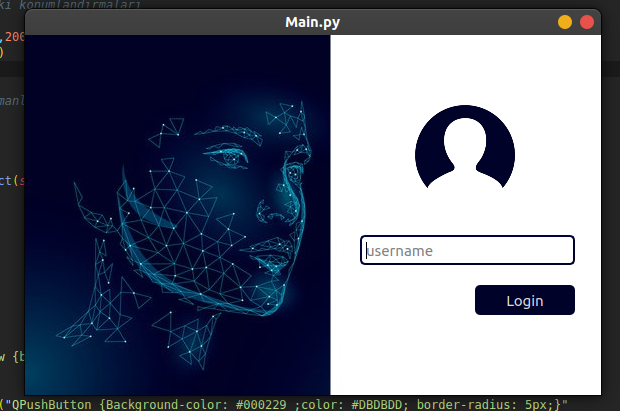

# Access Control with Face Recognition

This project provides access control using face recognition technology. It is developed using Python and the OpenCV library.




## Getting Started

This section includes the steps required to run the project on your local machine.

### Prerequisites

Make sure the following software is installed before running the project:

- Python 3.10.6
- OpenCV
- Dlib

### Installation

1. Clone the project to your local machine:

```
git clone https://github.com/rrumark/access-control-with-face-recognition.git
```
2. Install the required Python libraries:

```
pip install -r requirements.txt

```

## Usage

The project simulates access control based on face recognition. A camera is required for the face recognition process.

## Contributing

The project is still under development and open to contributions. To contribute, please follow these steps:

1. Fork the project
2. Identify the issue you want to add or fix
3. Create a new branch (`git checkout -b feature/AmazingFeature`)
4. Commit your changes (`git commit -m 'Add some AmazingFeature'`)
5. Push your branch (`git push origin feature/AmazingFeature`)
6. Create a Pull Request

## License

This project is licensed under the MIT License - see the [LICENSE.md](LICENSE.md) file for details.
